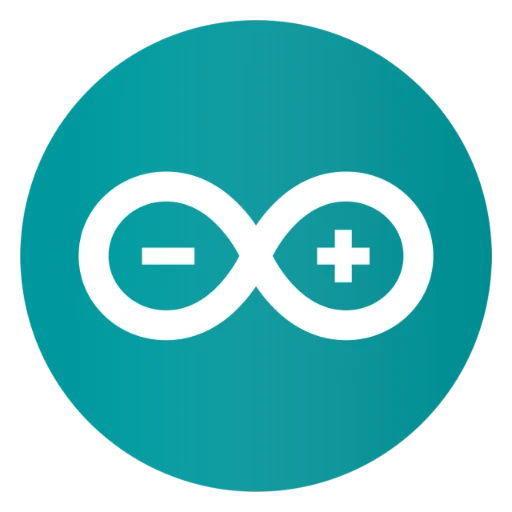
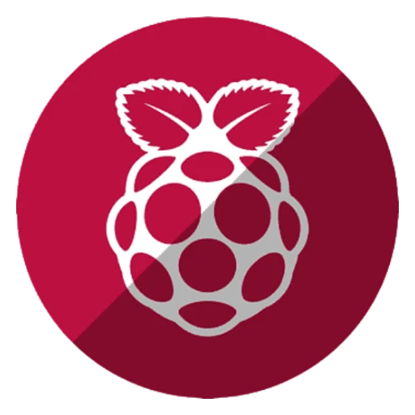
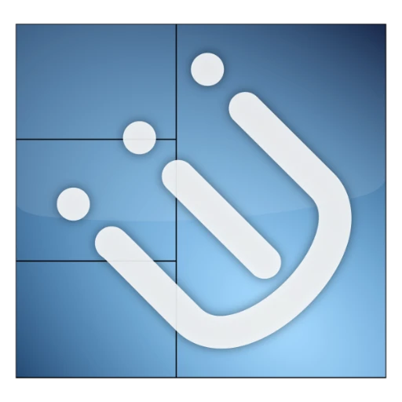

  

<h2 align = "center">GitHub Stats</h2>

  
  
  

  

  

  

  

<h3 align="center">Social Media</h3>

  
  
  
  

<h1></h1>
<h1>Tech Stack:</h1>

<h1>Platform:&nbsp;&nbsp;
  
  &nbsp;&nbsp;
  
  &nbsp;&nbsp;
</h1>

<h1>Languages:&nbsp;&nbsp;
  &nbsp;&nbsp;
  &nbsp;&nbsp;
  &nbsp;&nbsp;
  &nbsp;&nbsp;
</h1>

<h1>IoT:&nbsp;&nbsp;
  &nbsp;&nbsp;
  &nbsp;&nbsp;
</h1>

<h1>Opereting Systems:&nbsp;&nbsp;

  &nbsp;&nbsp;
  &nbsp;&nbsp;
  &nbsp;&nbsp;
  &nbsp;&nbsp;
  &nbsp;&nbsp;
  &nbsp;&nbsp;
  &nbsp;&nbsp;
  &nbsp;&nbsp;
  &nbsp;&nbsp;
  &nbsp;&nbsp;
</h1>

<h1>DE or WM:&nbsp;&nbsp;
  &nbsp;&nbsp;
  &nbsp;&nbsp;
  &nbsp;&nbsp;
  &nbsp;&nbsp;
</h1>

 

<h1>Currently in use:</h1>

<h1>OS:&nbsp;&nbsp;
  &nbsp;&nbsp;
</h1>

<h1>DE/WM:&nbsp;&nbsp;
  &nbsp;&nbsp;
</h1>

 

<h1>Member Of:</h1>

<h1>Group:&nbsp;&nbsp;
  &nbsp;&nbsp;
</h1>
