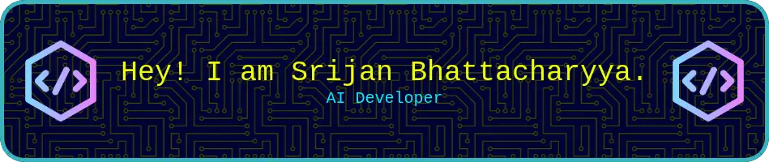

  

---

# 💫 About Me:
🔭 I’m currently working on ISHA, OpenBCI 🤝 I’m looking for help with OpenBCI, ISHA 🌱 I’m currently learning BCI, AI, ML, LLM, IoT, Linux Kernel

## 🌐 Socials:

## 🏆 GitHub Trophies

  

## 📊 GitHub Stats:

  
  
  
  

  
  

  

### 🔝 Top Contributed Repo

  

---

# 💻 Tech Stack:
## Programming Languages

## Shell
<!--  -->

## Frameworks

## Editors

## AI/ML Libraries

## Databases

## Other

## 💰 You can help me by Donating

